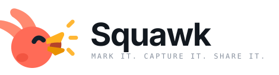
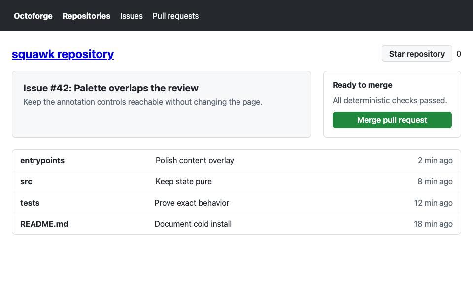

<p align="center">
  <picture>
    <source media="(prefers-color-scheme: dark)" srcset="logo/squawk-lockup-dark.svg" />
    <source media="(prefers-color-scheme: light)" srcset="logo/squawk-lockup.svg" />
    
  </picture>
</p>

Squawk is a general-purpose Chrome extension that lays a transparent markup layer over any web page, letting you draw, fill, label, select, and move feedback before capturing the result to share.

<p align="center">
  
</p>

## What it does

Squawk provides twelve tools without changing the page underneath:

- **Interact** — use the page normally while annotations remain visible.
- **Select** — select and drag one annotation. A box and label created by the Element picker move together, and every move can be undone.
- **Rectangle** — draw a rectangle or square, optionally with a fully opaque fill.
- **Ruler** — measure a rectangle or square and keep its width and height visible in the capture.
- **Circle** — circle an area, optionally with a fully opaque fill.
- **Arrow** — point from one place to another.
- **Pen** — draw a freehand stroke.
- **Text** — drag out a bounded text box; authored text wraps to its fixed width and grows downward when it needs more lines.
- **Element picker** — snap a box and selector label to a DOM element.
- **Font inspector.** Click an element to label its computed font size and font family.
- **Eyedropper.** Click a visible page pixel to add its hex color beside a circled marker.
- **Eraser** — remove an annotation, with undo available.

The draggable Palette controls annotation color, opaque shape fill, stroke width, solid/dashed/dotted stroke style, text size, undo, clear-all, capture, and teardown. Stroke width, Stroke style, and Text size use separate compact dropdowns that preview each choice. Style choices apply to newly drawn annotations without restyling existing work.

Undo is available from the Palette or with Ctrl/Cmd+Z for drawing, picking, moving, erasing, and clearing. Escape backs out one level at a time: it finishes or cancels the current interaction as appropriate, deselects the current annotation, returns to Interact, and finally closes Squawk.

Capture writes a viewport PNG to the clipboard when the browser exposes the required clipboard surface. If that surface is unavailable, Squawk downloads `squawk-annotation.png` instead.

Annotations live only in the current Squawk session. Squawk does not provide persistence, resizing, redo, or full-page capture.

## Permissions

The extension requests exactly three permissions:

- `activeTab` grants temporary access to the tab only after the extension action is invoked.
- `scripting` injects Squawk into that active tab on demand.
- `clipboardWrite` allows a completed capture to be copied for pasting elsewhere.

Squawk has no host permissions and registers no always-on content script. Its page overlay is injected only when the extension action is used.

## Usage

1. Open the page you want to review.
2. Select the Squawk extension action.
3. Choose a drawing tool and annotate the page. Use **Ruler** for a measured area, or **Fill shapes** for opaque rectangles, squares, or circles.
4. Choose **Eyedropper** to label a page pixel with its hex color.
5. Choose **Select** to reposition an annotation, or **Eraser** to remove one.
6. Select **Camera** to copy the annotated viewport or download the PNG fallback.
7. Paste, attach, or share the capture wherever you need it.
8. Select **Close Squawk** when finished.

## Cold install from source

Requirements: Node.js 22 or newer and pnpm 11.

```sh
pnpm install
pnpm zip
```

Then:

1. Unzip `.output/squawk-0.0.1-chrome.zip`.
2. Open `chrome://extensions` in Chrome.
3. Enable **Developer mode**.
4. Select **Load unpacked**.
5. Select the extracted directory containing `manifest.json`.

The extracted directory also contains `background.js`, `content-scripts/squawk.js`, and the four packaged icon sizes. The zip must be extracted before using **Load unpacked**.

For local development, `pnpm build` produces an unpacked extension at `.output/chrome-mv3`, which can be selected directly with **Load unpacked**.

## Development

```sh
pnpm dev
```

WXT watches the extension sources during development. After making changes, run the complete automated validation:

```sh
pnpm check
```

The check covers formatting, strict TypeScript, ESLint, unit tests, the production build, and Playwright demonstrations across deterministic fixture pages.

Regenerate the README demo from the real built extension flow with:

```sh
pnpm demo:gif
```

This rewrites `docs/assets/squawk-demo.gif` after the browser-driven sequence completes successfully.
